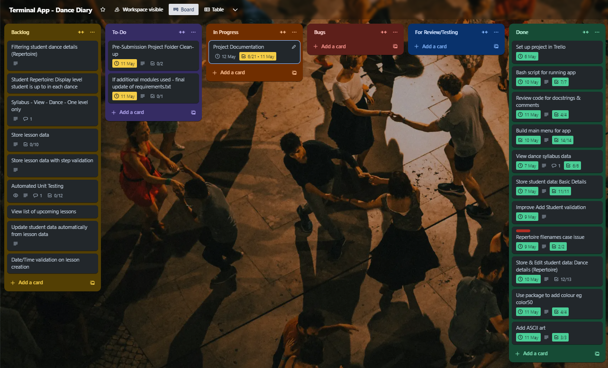

# T1A3 Terminal Application:  Dance Diary

## Overview & Purpose
**Dance Diary** is a terminal application to designed assist dance teachers, by storing their students' contact information, keeping track of students’ progress through the repertoire.

The initial project proposal also included a feature to develop lesson plans, which has not been completed for the initial release.

## Source Code Repository

The source code for this project is available on Github in the following repository:

[dancing-diary-terminal-app](https://github.com/jeskaj/dancing-diary-terminal-app)

## Style Guide

The following style guide was used for this project:

- [PEP 8 – Style Guide for Python Code](https://peps.python.org/pep-0008/)

## Installation Instructions

The Dance Diary application should be run by executing the script `dance_diary.sh`, from within in the `src` folder of this project.

From `/src`, run the following command:

`./dance_diary.sh`

This script will check that:
- Python3 is installed; and
- pip3 is installed

Assuming this is the case, it will then:
- install the required dependencies (as detailed below)
- run `main.py` to start the application

The user will then be presented with the application's Main Menu and can commence using the application.

*NOTE:  The script's permissions have been set to executable for all users, but in case of permission errors, run the command:*  `chmod +x dance_diary.sh`

### System Requirements

This application requires:
- Python3
- pip3

### Dependendcies

- art==6.2 (refer [art 6.2](https://pypi.org/project/art/))
- color50==1.0.1 (refer [color50 1.0.1](https://pypi.org/project/color50/))

### Program Manual

INSERT SCREENSHOTS & INSTRUCTIONS

## Features

Develop a list of features that will be included in the application. It must include:

- at least THREE features
- describe each feature, providing a walkthrough of the logic of the application.

Note: Ensure that your features above allow you to demonstrate your understanding of the following language elements and concepts:

- use of variables and the concept of variable scope
- loops and conditional control structures
- error handling

### Dance Syllabus
- Dance styles to be taught
- Steps in each dance, grouped into 3 levels

### Students
- Create new student and store:
    - Name, Email, Mobile
    - Dances student is learning
        - Steps within each dance they have learnt & whether they are competent in that step yet or not
        - Level of student within each dance (student cannot progress to next level until competent in all steps from previous level)
- View student information
- Update student information

STUDENT MENU:
[1]  Add New Student
[2]  View Student Contact Details & Repertoire
[3]  Update Student Contact Details
[4]  Update Student Repertoire Progress

1. User selects student
3. User selects from options to:
  a) Add a new step
    1. User is presented with a list of dances to choose from
    2. User selects dance
    3. User is presented a list of steps from the selected dance that may be added, which:
      - if all steps for the dance are completed:
        - advise user student has completed all steps for this dance
        - end
      - excludes steps already started or completed
      - unless all level 1 steps are completed, excludes level 2 & 3 steps
      - unless all level 2 steps are completed, excludes level 3 steps
    4. User selects a step to be added
    5. Step is added to student's repertoire with status Started

  u) Update an existing step
    1. User is presented with a list of dances to choose from
    2. User selects dance
    3. User is presented a list of steps from the selected dance that may be added, which:
      - if all steps for the dance are completed:
        - advise user student has completed all steps for this dance
        - end
      - excludes steps already started or completed
      - unless all level 1 steps are completed, excludes level 2 & 3 steps
      - unless all level 2 steps are completed, excludes level 3 steps
    4. User selects a step to be added
    5. Step is added to student's repertoire with status Started

[0]  Return to Main Menu

### Lessons
- Create lesson plan to store:
    - Student
    - Date & time of lesson (checks no lesson already scheduled for chosen date/time)
    - Dance styles/steps to be taught in lesson (level 2 & 3 steps can only be added if student is competent in all lower-level steps in chosen style)
- Update lesson to add notes about student progress
- Update student competency in steps taught after completion of lesson
- View individual lesson information
- View list of upcoming lessons scheduled

## Implementation Plan

The implementation plan for this project was created using [Trello](https://trello.com/) and can be access via the following link:

[Terminal App - Dance Diary](https://trello.com/b/bFwCFIW8/terminal-app-dance-diary)

The Trello workspace has been set to Public, but screenshots are also provided.

5 May, 2024:

7 May, 2024:

8 May 2024 - At this stage, determined that the Lesson module could not be developed for the initial project submission, so moved to Backlog:

9 May, 2024:

10 May, 2024:

11 May, 2024:

## References

Van Rossum, Warsaw & Coghlan 2001, *PEP 8 – Style Guide for Python Code*, 7 May 2024, https://peps.python.org/pep-0008/

Fletcher, D 2024, *This is color50*, 10 May, 2024, https://color50.readthedocs.io/

Art Development Team 2017, *ASCII Art Library for Python*, 10 May, 2024, https://pypi.org/project/art/