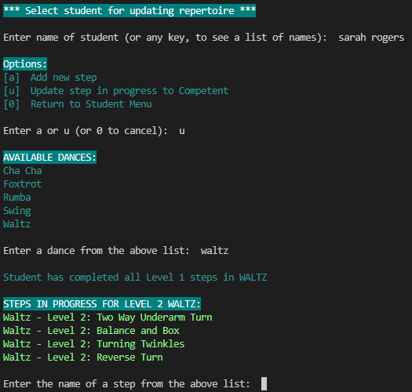

# T1A3 Terminal Application:  Dance Diary

## Overview & Purpose
**Dance Diary** is a terminal application to designed assist dance teachers, by storing their students' contact information and keeping track of students’ progress through the repertoire.

*NOTE: The initial project proposal also included a feature to develop lesson plans, which has not been completed for the initial release.*

## Source Code Repository

The source code for this project is available on Github in the following repository:

[dancing-diary-terminal-app](https://github.com/jeskaj/dancing-diary-terminal-app)

## Style Guide

The following style guide was used for this project:

- [PEP 8 – Style Guide for Python Code](https://peps.python.org/pep-0008/)

## System Requirements

This application requires:
- Python3
- pip3

### Dependendcies

- art==6.2 (refer [art 6.2](https://pypi.org/project/art/))
- color50==1.0.1 (refer [color50 1.0.1](https://pypi.org/project/color50/))

## Installation Instructions

The Dance Diary application should be run by executing the script `dance_diary.sh`, from within in the `src` folder of this project.

From `/src`, run the following command:

`./dance_diary.sh`

This script will check that:
- Python3 is installed; and
- pip3 is installed

Assuming this is the case, it will then:
- install the required dependencies (as detailed above)
- run `main.py` to start the application

The user will then be presented with the application's Main Menu.

*NOTE:  The script's permissions have been set to executable for all users, but in case of permission errors, run the command:*  `chmod +x dance_diary.sh`

## Program Features & Manual

### User Stories

This application is designed solely for the use of dance teachers, so the user stories used to develop the program's features were all taken from the perspective of a dance teacher.

The program features were developed from the following user stories:

As a dance teacher, I want to be able to:
1. View the syllabus of dances and dance steps I will be teaching students
2. Store my students’ names and contact details
3. View my students’ contact details
4. Update my students’ contact details
5. Keep track of my students’ progress in learning the syllabus for each dance
6. Create a lesson plan detailing the dances and steps I intend to teach a student at their next lesson

Acceptance criteria for these users stories were that the user must be able to:
1. View the whole dance syllabus in a readable format, or select just one dance to view
2. Add students to the app and store their name, email & mobile
3. View student contact details, for one or all students
4. Update students' email addresses and mobile numbers
5. Store, view & update students' progress through the syllabus, ensuring that students do not commence level 2 or 3 steps, before having completed all steps from the previous level/s.
6. Create, view & update lesson plans for students [FEATURE NOT DEVELOPED]

### Program Feature Manual

#### Main Menu

On running the program, the Main Menu is presented:

If any input is provided other than 1, 2, 3 or 0, the user is advised to try again and the Main Menu is presented again:

If `0` is selected to `Exit Program`, a farewell message is displayed before the program quits:

### [1] Syllabus

Syllabus data is stored in the file: `syllabus.json`

When `Syllabus` is selected from the Main Menu, the Syllabus Menu is presented:

If any input is provided other than 1, 2 or 0, the user is advised to try again (as shows above for Main Menu) and the Syllabus Menu is immediately presented again.

*NOTE:  The initial release of Dance Diary contains a single syllabus.json file, which comprises the Bronze Syllabus of five common styles taught in American Style ballroom dancing - Cha Cha, Foxtrot, Rumba, Swing and Waltz.  The syllabus for each dance is further divided into three levels (1, 2 and 3).*

*If the application is developed further, the intention would be to add additional features to allow dance teachers add and edit the dances and dance steps in the syllabus.  This functionality was not attempted in the initial release due to time constraints.*

#### [1] View Entire Syllabus

If this feature is chosen, the all steps in the syllabus.json file is displayed in readable format for the user to view, sorted by dance, then level:

At the end of the list, the total number of steps in the syllabus is display and the Syllabus Menu is presented again:

#### [2] View Syllabus by Dance

This feature can be selected to view only the steps for a single dance.  The user is presented with a list of the unique names of dances in the current syllabus and invited to make a selection.

Invalid selections produce a warning and instruct the user to enter a dance from the list provided.  To reduce the likelihood of invalid input, input is not case-sensitive.  Once a valid selection has been made, the steps for the chosen dance are displayed and the Syllabus Menu is presented again.

### [2] Students

Student data is stored in the file: `students.json`

When `Students` is selected from the Main Menu, the Student Menu is presented:

If any input is provided other than 1, 2, 3, 4 or 0, the user is advised to try again (as shows above for Main Menu) and the Student Menu is immediately presented again.

*NOTE: For the purposes of T1A3 assignment submission, the application contains some dummy student data to allow for easy testing.  All names and contact details are ficticious.*

#### [1] Add New Student

Select this feature to add a new student.

This feature requests the user enter the new student's full name.  If the name already exists, a warning is presented, to avoid duplication.  Validation is not case sensitive:

If a unique name is entered, the user is then prompted to provide the student's email and mobile.  The new student's information is then presented back to the user to check and confirm, with a warning that a student's name cannot be changed once the student is created.  If the creation is confirmed, a confirmation message is displayed, along with the total number of students now stored:

When a new student is created, as well as adding their data to the `students.json` file, a repertoire file is also created for the student in the `repertoire` folder.  This file is created by taking a copy of all of the steps in the syllabus.json file and adding a `status` of `New` to each step, to indicate that the student has not yet started learning the step.  The repertoire file is named in the format `studentname.json` eg Peter Parker's repertoire file is named `peterparker.json`.

#### [2] View Student Contact Details & Repertoire

This feature presents a choice between viewing a list of contact details for all students, or selecting a single student, to view both their contact details and repertoire progress.  Invalid input results in a warning and the user is remindered to select from the menu:

`[a]  View contact details for all students`

If `a` is selected, all student contact details are printed.  The total number of students is shown at the end of the list and the Student Menu is presented again:

`[s]  Select a single student to view contact details & repertoire progress`

If `s` is selected, the user is invited to enter a student name, or press any key to see a list of student names:

If the student is new and has not started learning any steps, the below message is displayed:

Once a student is selected who has started and/or completed learning at least one step, their contact details are displayed along with their dance steps, divided into two sections - those they are currently learning (status = Started) and those they have completed (status = Competent).  The Student Menu is then presented again:

#### [3] Update Student Contact Details

Use this feature to update student contact details.

When this feature is selected, the user is requested to enter the name of a student, or any key to see a list of current student names (as described in the previous feature).

Once a valid name has been entered, the user is presented with the student's current contact details and given the 

must choose to update the student's email or mobile.  The user will receive an `INVALID INPUT` warning if anything other than `e` or `m` is entered:

If `e` is entered, the user is prompted to enter the new email address and a confirmation message is displayed once submitted:

If `m` is entered, the user is prompted to enter the new mobile number and a confirmation message is displayed once submitted.  In both cases, the Student Menu is then presented again:

This data is updated accordingly in the `students.json` file.

#### [4]  Update Student Repertoire Progress

Use this feature to update a student's progress in the syllabus ie to add a new step for them to start learning, or to indicate when they have completed a step they are learning.

When this feature is selected, the user is requested to enter the name of a student, or any key to see a list of current student names.  Entering anything other than a valid student name results in an `INVALID INPUT` warning and the list of valid student names is presented (as described in previous features).

Once a valid student name has been entered, the user is presented with a choice between adding a new step or updating an existing step as completed (ie status = Competent):

`[a]  Add new step`

If `a` is selected, the program checks if the student has any new steps left to add and if they do not, displays a message advising the student has already started or completed all steps in the syllabus:

If there are still steps in the syllabus that the student has not started learning, a list of dances is presented to select from.  Invalid input results in a warning (as previously described).  Once a valid dance has been entered, the program checks if the student still has new steps to start in that dance and display a message if not:

Otherwise, a list of steps able to be added is displayed, noting that:

- If all Level 1 steps are not yet completed (Competent), only Level 1 steps will be displayed
- If all Level 1 steps are completed, Level 2 steps that are not yet completed will be displayed
- If all Level 1 & 2 steps are completed, Level 3 steps that are not yet completed will be displayed

*Example: Student has not completed Level 1 in Waltz:*

*Example:  Student has completed Levels 1 & 2 in Swing:*

Once a valid step is chosen, the status of the step in the student's repertoire .json file is updated to Started and a confirmation message is displayed:

`[u]  Update step in progress to Competent`

The flow of this feature is similar to that of `Add new step`, except that it will check if the student has any steps with a status of Started.  If not, the following message is displayed:

After a dance is chosen, only steps with status of Started will be displayed for selection:

Once a valid step is selected for completion, the status of the step is updated to Competent in the student's reperoire .json file and a confirmation message is displayed:

### [3] Lessons

As mentioned above, the Lessons module has not been completed for this initial release of the project.  Lessons is shown as `Coming Soon!` in the Main Menu.

If `Lessons` is selected from the main menu, the user is presented with the below message and the Main Menu is immediately presented again, so the user can make another selection:

Planned features for this module include:

- Create lesson plan to store:
    - Student
    - Date & time of lesson (checks no lesson already scheduled for chosen date/time)
    - Dance styles/steps to be taught in lesson (level 2 & 3 steps can only be added if student is competent in all lower-level steps in chosen style)
- Update lesson to add notes about student progress
- Update student competency in steps taught after completion of lesson
- View individual lesson information
- View list of upcoming lessons scheduled

## Implementation Plan

The implementation plan for this project was created using [Trello](https://trello.com/) and can be access via the following link:

[Terminal App - Dance Diary](https://trello.com/b/bFwCFIW8/terminal-app-dance-diary)

The Trello workspace has been set to Public, but screenshots are also provided.

One or more cards was created to track the development of each feature (depending on complexity) and checklists were created within each major card to further track the stages of developing each feature.  Due dates were added to cards and sometimes also to individual checklist items within cards.

5 May, 2024:

7 May, 2024:

8 May 2024 - At this stage, determined that the Lesson module could not be developed for the initial project submission, so moved to Backlog:

9 May, 2024:

10 May, 2024:

11 May, 2024 - Excluding Backlog tasks, final task remaining was to complete the documentation:

## References

Van Rossum, Warsaw & Coghlan 2001, *PEP 8 – Style Guide for Python Code*, 7 May 2024, https://peps.python.org/pep-0008/

Fletcher, D 2024, *This is color50*, 10 May, 2024, https://color50.readthedocs.io/

Art Development Team 2017, *ASCII Art Library for Python*, 10 May, 2024, https://pypi.org/project/art/